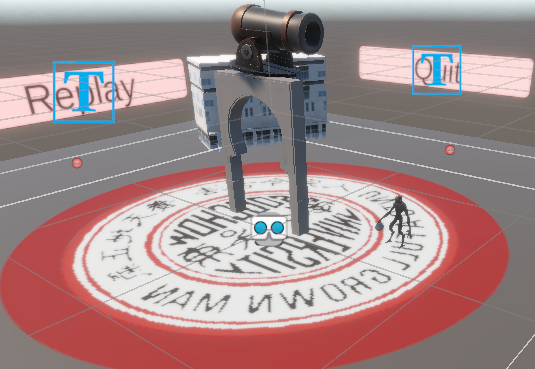
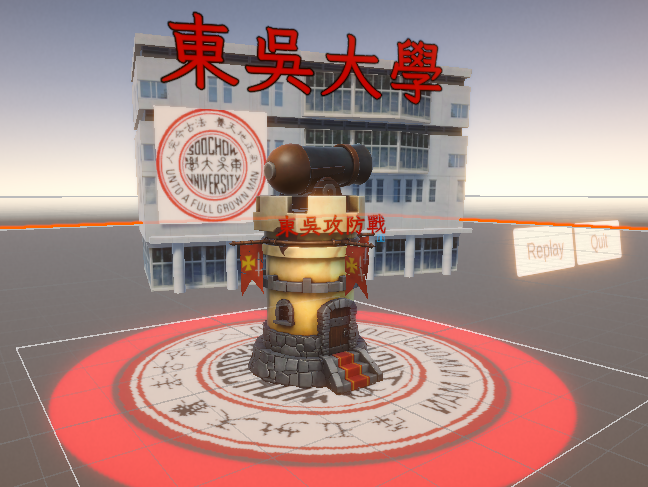

# Myfinal_202506 | Final Project

An interactive AR game built with Unity.

## Presentation / Demo
- Demo video: https://youtu.be/X2k5PqDQd9E

## Project Overview
**Soochow Defense Battle** is an AR tower-defense style mini game.  
Players defend the tower against stone monsters. The tower shoots enemies with visual effects, and the game provides Replay/Quit controls. I also customized the scene with Soochow-themed elements (text, buildings, and the school emblem).

## Core Features
- **Turret attack system:** the tower automatically attacks stone monsters.
- **VFX/SFX integration:** attacks include visual effects and sound effects.
- **Replay / Quit buttons:** Replay restarts the game; Quit exits.
- **HP system:** when monsters reach the tower, the tower’s health decreases; the game stops when HP reaches zero.
- **Scene customization:** added Soochow-related text, buildings, and the school emblem.

## Approach
- Built the AR experience with **AR Foundation** in Unity.
- Designed characters, animations, and action triggers within Unity.
- Implemented gameplay logic (attack, collision damage, UI controls, game states) in **C#** using Visual Studio.
- Exported the project as an **Android APK** for deployment.

## Results

  
  

## Tech Stack
- Unity
- C#
- AR Foundation
- Visual Studio
- (Optional/If used) Vuforia
